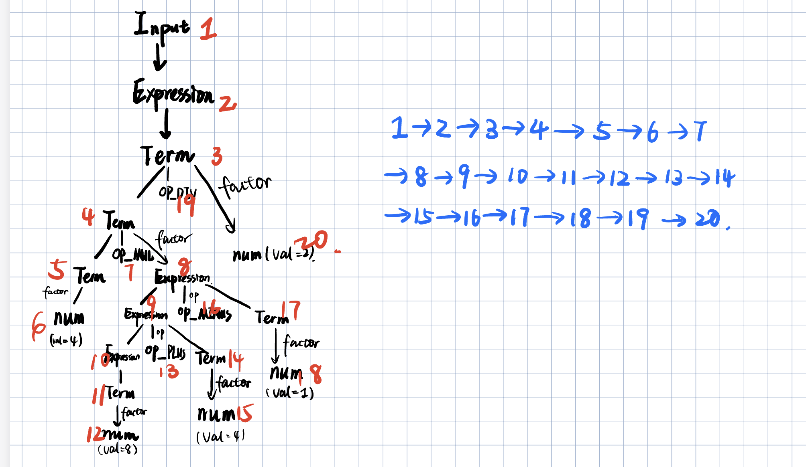

# Lab2

>
> Compiler

## Light IR 预热

1. 在 Light IR 简介里，你已经了解了 IR 代码的基本结构，请尝试编写一个有全局变量的 cminus 程序，并用 clang 编译生成中间代码，解释全局变量在其中的位置。

答：**C-Lang** 程序

```c
int a;
int b;
int main(void) {
    a=1;
    b=2;
    return a+b;
}
```

用 clang 编译生成 **中间代码 *.ll**

```assembly
@a = dso_local global i32 0, align 4
@b = dso_local global i32 0, align 4

; Function Attrs: noinline nounwind optnone uwtable
define dso_local i32 @main() #0 {
  %1 = alloca i32, align 4
  store i32 0, i32* %1, align 4
  store i32 1, i32* @a, align 4
  store i32 2, i32* @b, align 4
  %2 = load i32, i32* @a, align 4
  %3 = load i32, i32* @b, align 4
  %4 = add nsw i32 %2, %3
  ret i32 %4
}
;省略其他部分
```

在上面的代码中可以看到，编译生成的中间代码，在 `define` 之前，已经声明了全局变量

```
@a = dso_local global i32 0, align 4
@b = dso_local global i32 0, align 4
```

**在LLVM中，全局变量通常存储在数据段（data segment）中，而局部变量存储在栈上。**它们在程序的整个生命周期内都可见。而 `%1` 是 `main` 函数内的局部变量，只在 `main` 函数的执行期间存在。

------

2. Light IR 中基本类型 label 在 Light IR C++ 库中是如何用类表示的？

**答：**`label` 是基本块的标识符类型，在 Light IR C++ 库使用 `BasicBlock` 来表示

----

3. Light IR C++ 库中 `Module` 类中对基本类型与组合类型存储的方式是一样的吗？请尝试解释组合类型使用其存储方式的原因。

**答：** `IntegerType`, `FloatType` 对应表示 Light IR 中的 `i1`，`i32`，`float` 基本类型，通常会直接存储它们的值。这意味着基本类型的值被编码为其直接的二进制表示。例如，一个整数值4会以4的二进制形式存储，而不需要额外的引用或指针。

而组合类型包括 `ArrayType`，`PointerType`，`FunctionType`, 这些类型通常占用多个连续的内存位置，因此需要引用或指针来表示它们的地址，因为结构体和数组可能包含多个成员或元素，它们的大小和布局不适合直接存储在寄存器中或栈上。因此，使用指针来引用它们的内存位置是更为灵活和高效的方式

# 访问者模式


