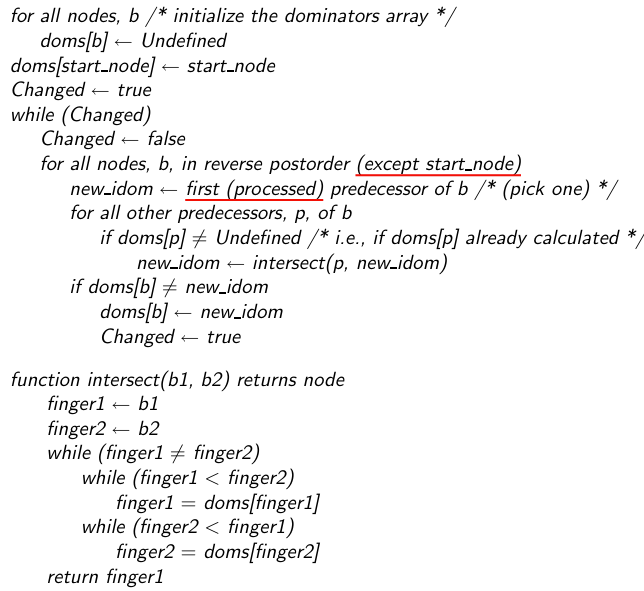
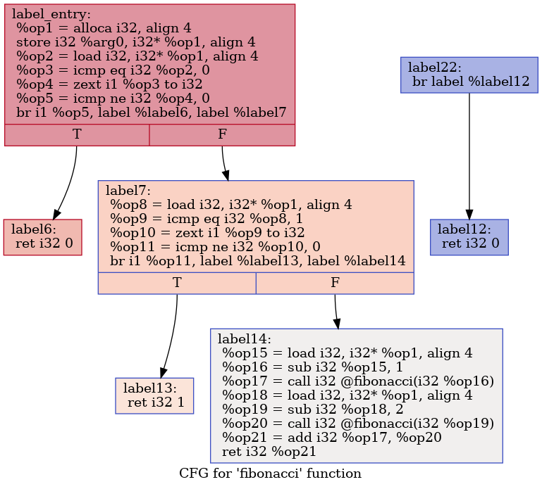
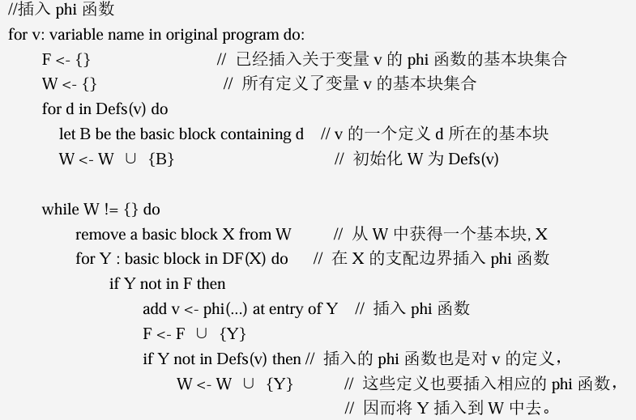
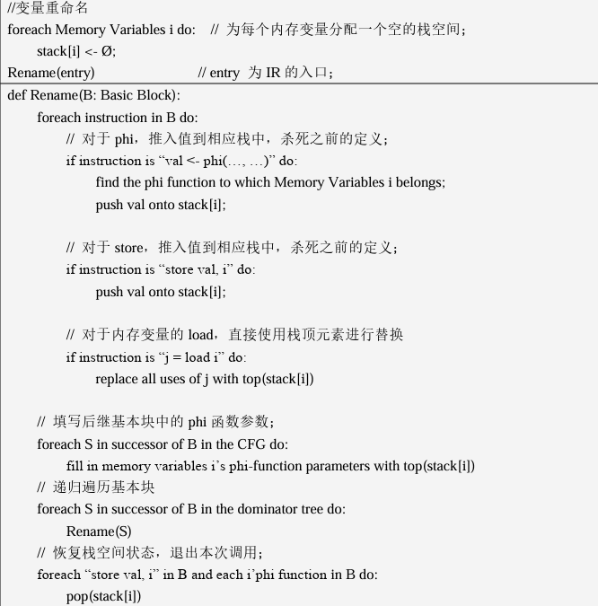
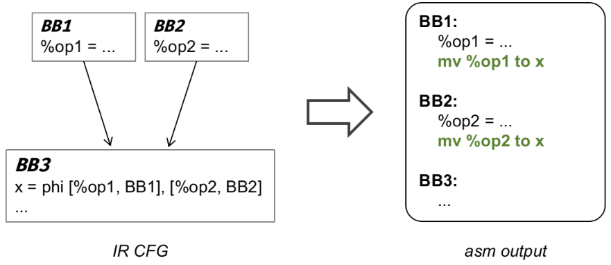
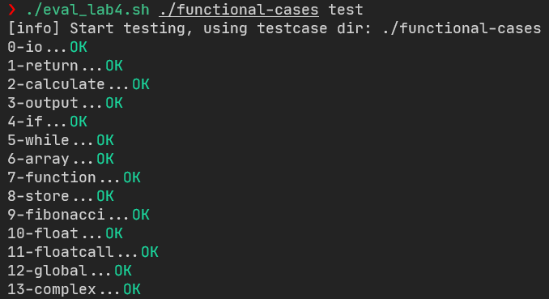
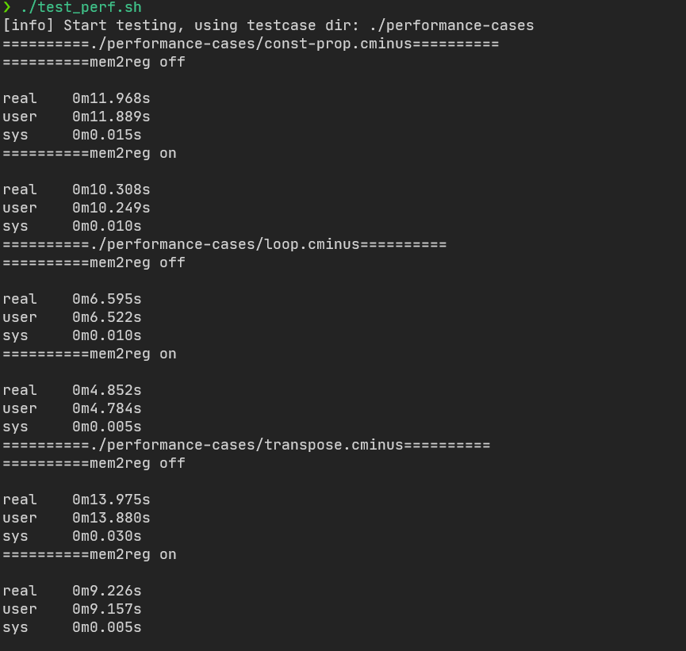

# Compiler Lab4

> PB20020480 王润泽
>
> 实验环境：Windows11 WSL2 Ubuntu 22.04.3 LTS
>
> flex 2.6.4, bison 3.8.2,GNU gdb12.1,clang llvm 14.0.0

## 1. Abstract

经过前序实验，已经基本完成了一个贯穿从前端到后端的简单编译器。然而，该编译器生成的代码只能保证语义正确、能在目标机器上运行。接下来通过增加优化 pass 让生成的代码快起来。在本实验中主要采取 **Mem2Reg** 优化方法，确保 **IR** 所有变量都符合SSA形式

## 2. Method

编译器为了简化前端设计，往往引入`alloca/load/store`等指令。在处理栈或局部变量时，编译器前端通过`alloca`指令将每个局部变量映射到栈上一个对应的空间，将读写映射为对应空间的`load/store` 指令。这种方案简化了前端设计，但是在IR上需要进行相关优化时，消除这些不必要的内存操作。因为寄存器的访问速度远快于内存独写，从而 **Mem2Reg** 可以有效改善程序的性能。消除`alloca/load/store`等操作的优化被称为 **Mem2Reg Pass **。 

Mem2Reg代码优化方法分成三步：

1. 根据已有的 **CFG** Basic Blocks 生成支配树
2. **IR阶段**：根据支配树，在合适的位置插入 $\phi$ 函数，变量重命名，删除 `alloca`, `store`, `load`
3. **汇编阶段**：将 phi函数 转化成汇编代码

### 2.1 Dominator Tree

##### 定义

- **支配**：$x$支配$y \Leftrightarrow$ 从起始节点到$y$的每条路径都经过了$x$，记作 $x\in Dom(y)$
- **严格支配**：$x$严格支配$y \Leftrightarrow x$支配$y$ 且 $ x \neq y$
- **直接支配**：$x$是$y$的直接支配者$\Leftrightarrow x$严格支配$y$且$\forall z$严格支配$y$，$x$不严格支配$z$，记作 $IDom(y)=x$
  - 一个节点的 $IDom$ 是唯一的
  - $y$的 $IDom$ 就是离$y$最接近的严格支配$y$的节点
- **支配边界**：$y \in x$的支配边界$\Leftrightarrow x$支配了$y$的前驱节点 $pre$，但 $pre$ 没有严格支配 $y$ (即 $pre\notin Dom(y)$ 或 $pre=y$ ), 记作 $y\in DF(x)$
  - 支配边界可能为 $\varnothing$ 也可能其自身，也可能不止一个
- **支配树**：每个节点与其 $IDom$ 之间生成了一颗树

根据支配域的性质, 

$$
Dom(b)=\{b\}\cup IDom(b)\cup IDom(IDom(b))....\{entry\}
$$

只要计算出每个节点的直接支配节点，就可以获得每个节点的支配集合和支配树

##### 算法1：直接支配节点生成



上面的算法中 `doms[node]` 是 `node` 的直接支配节点，`postorder` 则可以通过深度优先(**dfs**)算法生成的顺序。在执行时，沿着 `reverse postorder` 逆后序的顺序进行变量，直观上就是从 **high height** 的节点到 **low height** 节点遍历。

实际代码如下

```cpp
//std::map<BasicBlock *, BasicBlock *> idom_{};  // 直接支配
void Dominators::dfs(std::vector<BasicBlock *> &dfn,
                     std::unordered_map<BasicBlock *, bool> &visited,
                     BasicBlock *bb) {
  visited[bb] = true;
  for (auto &succ : bb->get_succ_basic_blocks()) {
    if (!visited[succ]) {
      dfs(dfn, visited, succ);
    }
  }
  dfn.push_back(bb);
}

int Dominators::intersect(int b1, int b2,const std::vector<int> &doms){
    while(b1!=b2){
        while(b1<b2)
            b1=doms[b1];
        while(b2<b1)
            b2=doms[b2];
    }
    return b1;
}

void Dominators::create_idom(Function *f) {
    auto bb_entry = f->get_entry_block();
    std::unordered_map<BasicBlock *, bool> visited{};
    for(auto&bb1: f->get_basic_blocks()){
        auto bb=&bb1;
        visited.insert({bb,false});
    }
    
    std::vector<BasicBlock*> dfn;
    dfs(dfn,visited,bb_entry);
    int bb_num = dfn.size();
    
    std::unordered_map<BasicBlock *, int> postorder{};
    for(int i=0;i<bb_num;i++){
        postorder.insert({dfn[i],i});
    }

    std::vector<int> doms(bb_num,-1);
    doms[bb_num-1]=bb_num-1;
    bool changed;
    do{
        changed = false;
        for (int i = bb_num - 2; i >= 0; i--){// in reverse postorder
            auto bb=dfn[i];
            int new_idom=-1;
            for(auto& pred:bb->get_pre_basic_blocks()){
                int pred_num=postorder[pred];
                if(new_idom==-1){
                    new_idom=pred_num;
                }
                else if(doms[pred_num]!=-1){// if doms[pred_num] is not undefined
                    new_idom=intersect(pred_num,new_idom,doms);
                }
            }
            if(doms[i]!=new_idom){
                doms[i]=new_idom;
                changed=true;
            }            
        }
    } while (changed);
    for(int i=0;i<bb_num;i++)
      idom_[dfn[i]]= dfn[doms[i]];
}
```

##### 算法2：支配树生成

获取支配树，实际上就是找每个节点所支配的集合，即各个节点在支配树的后继

```cpp
//std::map<BasicBlock *, BBSet> dom_tree_succ_blocks_{}; // 支配树中的后继节点
void Dominators::create_dom_tree_succ(Function *f) {
    for(auto& bb1:f->get_basic_blocks()){
        auto bb=&bb1;
        if(bb!=f->get_entry_block()&&idom_[bb]!=nullptr)
            dom_tree_succ_blocks_[idom_[bb]].insert(bb);
    }
}
```

==值得注意的是==：在实践中，会出现在一个函数中，存在 $entry$ 没有支配的节点，这类基本块节点，主要出现在最后基本块不是 $return$ 语句中，在 **IR** 时为其自动生成了一些基本块，处理方法是将这些基本块忽略，因为这些基本块往往没有对遍历的调用



##### 算法3：支配边界生成

根据支配边界的定义：$y \in x$的支配边界$\Leftrightarrow x$支配了$y$的前驱节点 $pre$，但 $pre$ 没有严格支配 $y$，算法如下：

```cpp
void Dominators::create_dominance_frontier(Function *f) {
    for(auto& bb1:f->get_basic_blocks()){
        auto bb=&bb1;
        if(bb->get_pre_basic_blocks().size()>=2)
            for(auto& pred:bb->get_pre_basic_blocks()){
                auto runner=pred;
                while(runner!=idom_[bb]){
                    dom_frontier_[runner].insert(bb);
                    runner=idom_[runner];
                }
            }
    }
}
```

### 2.2 IR Stage

重新分析 IR 的所有基本块，首先需要找到在多个基本块定义的变量，称作 **活跃变量** $v$，这些变量所被定义的基本块，记作 $Defs(v)$。

$\phi$ 函数的作用就在于，当一个基本块存在多个前驱基本块时，$\phi$ 函数在基本块开头里合并来自多个不同前驱基本块的对同一个变量的多个定义，这样就能保证在一个基本块中定义的唯一性。定义如下
$$
op=\phi(\{op_1,B_1\},\{op_2,B_2\}...)
$$
其中 $B_1,B_2,..$ 是当前基本块 $B$ 的前驱结点，当从 $B_i$ 跳转到 $B$ 时，$op=op_i$, 以此类推。 

有多个前驱的基本块即为汇合点（join block）。对于一个基本块集合 $S$，如果一个基本块是𝑆中的至少两个基本块的汇合点，那么这个基本块是这个集合的汇合点。基本块集合 $S$ 的汇合点集记为 $J(S)$。

对于在每个基本块开头新插入的 $\phi$ 函数也是对 $v$ 的定义，它们对应的 $\phi$ 函数需要在 $J(Defs(v)\cup J(Defs(v)))=J(Defs(v))$ 中设置。

在算法上则利用 **支配边界** $DF$ 的性质，来定义汇合点：在一个基本块 $B$ 中对变量 $v$ 进行定义，在不考虑路径中对变量进行重新定义的情况下，所有被 $B$ 支配的基本块中，$v$ 的值一定是 $B$ 中所定义的值。而对于 $B$ 的支配边界中的基本块，情况则有所不同：它们的控制流不一定来自于 $B$ ，$v$ 的值只是有可能是 $B$ 中所定义的值。支配边界所支配的基本块中，当然也无法确定 $v$ 的值。支配边界是恰好不能确定 $v$ 是否取 $B$ 中所定义的值的分界线。
$$
J(Defs(v))=J(Defs(v)\cup\{entry\})=DF^+(Defs(v))\\
DF^+(S)=lim_{i\rarr\infin}DF_i(S), \quad DF_{i+1}=DF(S\cup DF_i),\quad DF_1(S)=DF(S)
$$

##### 算法4：插入 $\phi$ 函数



在代码实现上要先找到活跃变量，再进行插入 $\phi$ 函数

```cpp
void Mem2Reg::generate_phi() {
    // 步骤一：找到活跃在多个 block 的全局名字集合，以及它们所属的 bb 块
    val_defset_map_.clear();//活跃变量所定义的集合
    global_active_val_set_.clear();//活跃变量
    phi_map_.clear();//phi函数与对应定义活跃变量的映射
    reg_stk_map_.clear();//活跃变量定义栈

    for(auto& bb:func_->get_basic_blocks()){
        for(auto& ins:bb.get_instructions()){
            if(ins.is_store()){
                auto l_val = ins.get_operand(1);
                //获取的是一个指针，指向alloca的位置
                //排除全局变量和gep指令(数组或者指针的偏移量)
                if(is_valid_ptr(l_val)){
                    if(global_active_val_set_.find(l_val)==global_active_val_set_.end()){
                        global_active_val_set_.insert(l_val);
                        val_defset_map_.insert({l_val,{}});
                        reg_stk_map_.insert({l_val,std::stack<Value*>{}});
                    }
                    val_defset_map_[l_val].insert(&bb);
                }
            }
        }
    }
    // 步骤二：从支配树获取支配边界信息，并在对应位置插入 phi 指令
    std::queue<BasicBlock*> Defs;
    std::set<BasicBlock *> Frontiers;
    for(auto&active_val:global_active_val_set_){
        if(val_defset_map_[active_val].size()==1)//只有一个定义块，不需要插入phi指令，进行剪枝
            continue;
        for(auto&bb:val_defset_map_[active_val])
            Defs.push(bb);
        while(!Defs.empty()){
            auto bb = Defs.front();
            Defs.pop();
            for(auto& frontier:dominators_->get_dominance_frontier(bb))
                if(Frontiers.find(frontier)==Frontiers.end()){// 该边界点还未插入phi指令
                    // 插入边界点
                    Frontiers.insert(frontier);
                    // 插入phi指令
                    auto alloca_inst = dynamic_cast<AllocaInst*> (active_val);
                    auto phi_inst = PhiInst::create_phi(alloca_inst->get_alloca_type(),frontier);
                    frontier->add_instr_begin(phi_inst);
                    phi_map_.insert({phi_inst,active_val});                    
                    if(val_defset_map_[active_val].find(frontier)==val_defset_map_[active_val].end()){
                        val_defset_map_[active_val].insert(frontier);
                        Defs.push(frontier);
                    }
                }
        }
        Frontiers.clear();
    }
}
```

##### 算法5： 变量重命名

变量重命名的含义是：使用栈结构来存储内存变量的值；当对程序进行扫描的时候，碰到 store指令或者内存变量对应的phi函数，则将对应的值推入栈中，即当前的定义杀死的该内存变量之前的定义；当碰到load指令时，则将栈顶元素赋予对应的寄存器，因为该栈顶元素是当前唯一可达的定义。



具体实现上：

```cpp
void Mem2Reg::rename(BasicBlock *bb) {
    // TODO
    // 步骤三：将 phi 指令作为 lval 的最新定值，lval 即是为局部变量 alloca 出的地址空间
    // 步骤四：用 lval 最新的定值替代对应的load指令
    // 步骤五：将 store 指令的 rval，也即被存入内存的值，作为 lval 的最新定值    
    Value* lval;
    Value* val;
    for(auto& ins:bb->get_instructions()){
        if(ins.is_phi()){
            lval = phi_map_[&ins];
            val = dynamic_cast<Value* > (&ins);
            reg_stk_map_[lval].push(val);
            
        }else if(ins.is_store()){
            lval = ins.get_operand(1);
            if(is_valid_ptr(lval)){
                val = ins.get_operand(0);
                reg_stk_map_[lval].push(val);
            }
        }else if(ins.is_load()){
            lval = ins.get_operand(0);
            if(is_valid_ptr(lval)){
                val = reg_stk_map_[lval].top();
                ins.replace_all_use_with(val);
            }
        }
    }
    // 步骤六：为bb后继基本块中 lval 对应的 phi 指令参数补充完整
    for(auto& succ_bb:bb->get_succ_basic_blocks())
        for(auto& ins:succ_bb->get_instructions()){
            if(ins.is_phi()){
                auto phi_inst = dynamic_cast<PhiInst*>(&ins);
                lval = phi_map_[phi_inst];
                if(!reg_stk_map_[lval].empty()){
                    val = reg_stk_map_[lval].top();
                    phi_inst->add_phi_pair_operand(val, bb);
                }
            }
        }

    // 步骤七：对 bb 在支配树上的所有后继节点，递归执行 re_name 操作
    for(auto& succ_bb:dominators_->get_dom_tree_succ_blocks(bb)){
        rename(succ_bb);
    }
    
    // 步骤八：pop出 lval 的最新定值
    for(auto& ins:bb->get_instructions()){
        if(ins.is_phi()){
            lval = phi_map_[&ins];
            reg_stk_map_[lval].pop();
        }else if(ins.is_store()){
            lval = ins.get_operand(1);
            if(is_valid_ptr(lval)){
                reg_stk_map_[lval].pop();
            }
        }
    }

    // 步骤九：清除冗余的指令:涉及内存变量的所有store指令
    // 不包含全局变量，指针，数组
    // alloca/load指令
    std::unordered_set<Instruction *> wait_del{};
    for (auto it = bb->get_instructions().begin();
         it != bb->get_instructions().end(); it++) {
        auto inst = &*it;
        if (inst->is_store() && is_valid_ptr(inst->get_operand(1))) {
            wait_del.insert(inst);
        }
    }

    for (auto inst : wait_del)
      inst->remove_all_operands();
    for (auto inst : wait_del)
      inst->get_parent()->get_instructions().erase(inst);
}
```

==值得注意的是==: 在对 $\phi$ 函数的变量进行回填时，可能会出现 $\phi$ 所在基本块的前驱基本块没有对某活跃变量的定义，此时不应当进行回填操作，而是略过该前驱基本块

### 2.3 汇编阶段

在对 **IR** 指令 $\phi$ 函数进行汇编翻译时，采取的策略是：copy statement

 

在具体实现上，则是在即将进行 `br` 或 `br_cond` 跳转之前，判断跳转目标基本块是否含有对应的 $\phi$ 指令，如果有，则预先进行 $copy$ 操作，代码如下：

```cpp
void CodeGen::gen_br() {
    auto *branchInst = static_cast<BranchInst *>(context.inst);
    if (branchInst->is_cond_br()) {
        // TODO: 补全条件跳转的情况
        load_to_greg(branchInst->get_operand(0), Reg::t(0));
        auto *truebb = static_cast<BasicBlock *>(branchInst->get_operand(1));
        gen_phi(truebb);
        
        auto *falsebb = static_cast<BasicBlock *>(branchInst->get_operand(2));
        gen_phi(falsebb);
        
        append_inst("beqz", {Reg::t(0).print(),label_name(falsebb)});
        append_inst("b",{label_name(truebb)});
    } else {
        auto *branchbb = static_cast<BasicBlock *>(branchInst->get_operand(0));
        gen_phi(branchbb);
        append_inst("b",{label_name(branchbb)});
    }
}

void CodeGen::gen_phi(BasicBlock *branchbb) {
    for(auto&inst:branchbb->get_instructions())
        if(inst.is_phi())
            for(int i=0;i<inst.get_num_operand();i+=2){
                auto val_bb = static_cast<BasicBlock*>(inst.get_operand(i+1));
                if(val_bb==context.bb){
                    auto val = inst.get_operand(i);
                    if(val->get_type()->is_float_type()){
                        load_to_freg(val, FReg::ft(0));
                        store_from_freg(&inst, FReg::ft(0));
                    }else{
                        load_to_greg(val, Reg::t(0));
                        store_from_greg(&inst, Reg::t(0));
                    }
                }
            }
}
```

## 3. Experiment

按照如下进行项目编译

```sh
cd 2023ustc-jianmu-compiler
mkdir build
cd build
# 使用 cmake 生成 makefile 等文件
cmake ..
# 使用 make 进行编译，指定 install 以正确测试
sudo make install
```

按照如下方式进行使用：以`test.cminus` 为例

```sh
#编译到 IR 不开启优化
cminusfc -emit-llvm test.cminus
#编译到 IR 开启优化
cminusfc -emit-llvm -mem2reg test.cminus
```

```sh
#编译到汇编 不开启优化
cminusfc -S test.cminus
#编译到汇编 开启优化
cminusfc -S -mem2reg test.cminus
```

### 3.1 正确性检验



### 3.2 性能检验


