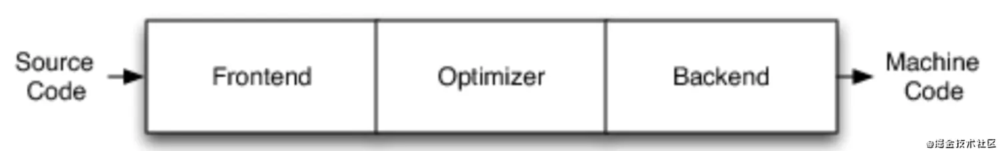
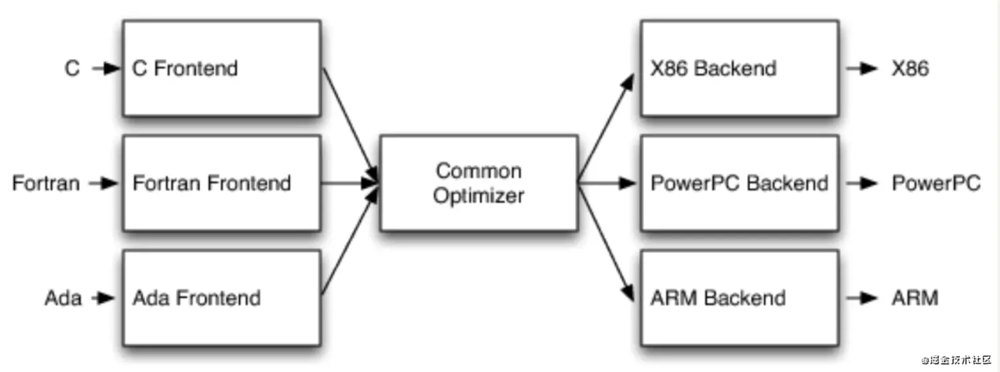
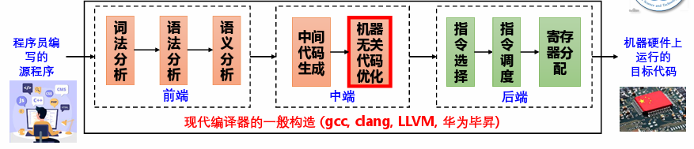
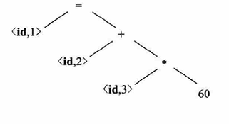
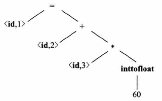
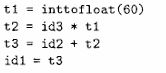
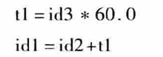
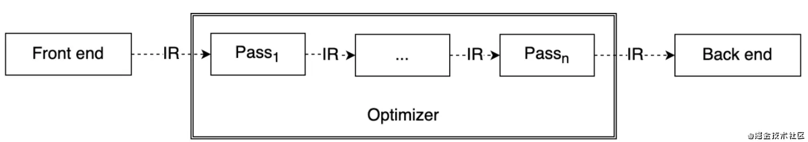
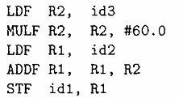
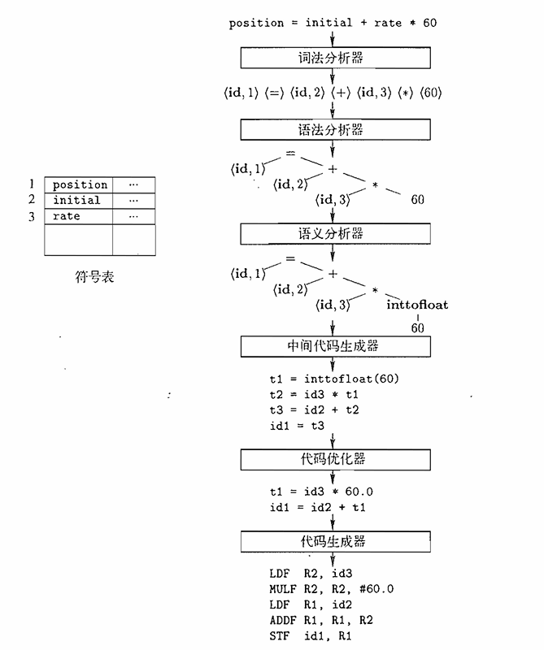

# 《计算机导论》课程报告——编译器

> PB20020480 王润泽

大多数软件是使用高级程序设计语言来编写的。用这些语言编写的软件必须经过编译器的编译，才能转换为可在计算机上运行的机器代码。然而高级语言种类繁多，在不同的体系架构下机器代码也各有不同，如何将这些高级语言正确地、高效地转化成机器代码，将会直接影响成千上万的软件。本文将以 LLVM 为例, 介绍现代编译器基本框架，并在此基础上，展现计算机导论课程所涉及到的计算思维概念，包括但不限于：模块化、抽象化、通用性和系统性。

## 1. 编译器架构

编译器（Compiler）是一种计算机程序，它会将某种编程语言写成的源代码(原始语言)转换成另一种编程语言(目标语言)。在这个过程中，编译器的工作分成若干阶段，每一阶段把源程序从一种表示变换到另一种表示。

传统编译器架构一般分成三个部分：

- 前端（`Frontend`）：解析源代码，检查源代码是否有错误，并构建特定语言的抽象语法树（`Abstract Syntax Tree`缩写:`AST`）来表示输入的代码。也负责选择性的地将`AST`转换为新的表示形式以进行优化。

- 中间优化器（`Optimizer`）：负责将 `AST` 转化成中间代码,并进行各种转换，以尝试改善代码的运行时间，例如消除冗余计算，并且通常或多或少地独立于编程语言和目标代码。

- 后端（`Backend`）：也称代码生成器，将代码映射到目标架构的指令集上；其常见部分有：指令选择，寄存器分配，指定调度。

  

这种架构的优势在于解耦合，实现一种编程语言，只需要实现它的前端，对于优化器与后端部分是可以复用的；支持新的目标架构，只需要实现它的后端即可；如果编译器不是这种架构，三部分未分开，那么实现`N`个编程语言，去支持`M`个目标架构，就需要实现`N*M`个编译器

这样的设计框架体现了**模块化、抽象化**的计算思维概念，整体的设计符合 **通用性和系统性**的计算思维

更为具体的框架结构如下图所示：

## 2. 前端

前端解析源代码，检查源代码是否有错误，并构建特定语言的抽象语法树（`Abstract Syntax Tree`缩写:`AST`）来表示输入的代码。也负责选择性的地将`AST`转换为新的表示形式以进行优化。

在前端设计过程中体现了 **正确性,抽象化,模块化,无缝衔接**的计算思维

### 2.1 词法分析

编译器的第一个步骤称为词法分析(`lexical analysis`)。词法分析器将读入组成源程序的字符流，并将它们组成为有意义的词素(`lexeme`)的序列。对于每个词素，词法分析器产生词法单元 (`token`)，作为输出记号流，传给下一个步骤。
$$
\text{token=<token-name,attribute-value>}
$$
一个 `token` 中，第一个分量是 `token-name`，即在下一个步骤语法分析中使用的抽象符号，比如：`while`, `if`, `+,-,*,/` 等常见的标识符以及变量名称 `id` 等；第二个分量是 `attribute-value`，它指向符号表中关于这个 `token` 的调用，方便在语法分析阶段调用相关的条目索引。

比如一个源程序包括如下赋值语句
$$
\text{position=initial+rate*60}
$$
这个字符流将通过正则匹配(`Regex`)的方式提取相应的词素，形成 `token`
$$
\text{<id,1><=><id,2><+><id,3><*><60>}
$$
当后面的流程中需要确定某个 `id` 时，只要利用 `attribute-value` 在符号表中查找，即可获取 `id` 的名称

### 2.2 语法分析

前端中第二个步骤称为语法分析(`syntax analysis`)，它检查词法分析输出的记号流是否符合编程语言的语法规则，并根据这些规则所体现出的语言来构造相应的优先级层级结构。一种常用的结构表示是语法树(`syntax tree`), 树中的每个内部节点表示一个运算，而该节点的子节点表示该运算的分量。

后面各个阶段将使用这种语法树进一步分析源程序和生成目标代码。

### 2.3 语义分析

语义分析(`semantic analyzer`) 使用语法树和符号表中的信息来检查源程序是否和高级语言定义的语义一致。同时收集类型信息，把这些信息存放在语法树或符号表中，以便在中间代码生成过程中使用。

语义分析中一个重要的步骤是类型检查，编译器检查啊每个运算符是否具有匹配的运算分量。比如，许多语言设计时要求数组的下标为一个整数，如果采用浮点数作为数组下标，编译器此时应该及时报错。

语义分析的另一个步骤是自动类型转换。比如当一个二元运算符应用于一个浮点数和整数时，编译器应当能够将这个整数自动转化成一个浮点数

## 3. 中端

中端负责进行各种转换尝试，改善代码的执行时间，比如消除冗余计算。通常或多或少与语言及目标无关。这一过程中很好的做到了**抽象化,通用性,构造性,连接性 **

### 3.1 中间代码生成

经过语法分析和语义分析,许多编译器产生更低级的显示中间表示(`Intermediate Representation/IR`),并且这种中间表示易于翻译成目标机器代码.

现代编译器中 `LLVM` 最重要的设计就在于其中间表示,这类中间表示具有一下特点:

- 采用 3 地址的方式: `%2 = add i32 %0, %1`
- 无限寄存器 + 静态单赋值形式
- 强类型系统:每个操作数都具备自身的类型，分为基本类型，以及组合类型
  - 基本类型 `<type>` : `i1`, `i32`, `float`, `label`
  - 组合类型: 指针类型 `<type> *`, 数组类型 `[n x <type>]`, 函数类型 `<ret-type>@(<arg-type>)`

比如上面语法树产生的三地址码写作

### 3.2 中间代码优化

机器无关的代码优化试图改进中间代码,以便生成更短,更快,更省内存的目标代码,比如上述三地址码可以优化为

LLVM 与其它编译器最大的差别是，它不仅仅是 Compiler Collection，也是Libraries Collection。举个例子，假如说即将要写一个 X 语言的优化器，实现了 `PassX` 算法，用以处理 X 语言与其它语言差别最大的地方。而 LLVM 优化器提供的 `PassA` 和 `PassB` 算法则提供了 X 语言与其它语言共性的优化算法。那么在编写优化代码时,可以选择 X 优化器在链接的时候把LLVM 提供的算法链接进来.大大提高了代码的复用性.

## 4. 后端

后端的主要任务是以源程序的中间表示作为输入,并把它翻译成机器代码指令集,除了编写正确的代码外，它还负责生成利用所支持体系结构的不寻常特性的良好代码。一个编译器后端的通用部分包含指令选择，寄存器分配，及指令调度.

代码生成的一个重要的方面是合理分配变量的值,往往在中间代码优化时会做.比如上述中间代码可以翻译成如下机器码:

## 5. 总结

以上流程,将一个简单的赋值语句翻译如下图

在一个特定的实现中,多个步骤的活动可以被组合成一趟(pass).每趟读入一个输入文件并产生一个输出文件.比如,前端步骤中的词法分析, 语法分析, 语义分析以及中间代码生成可以被组合在一起生成一趟. 代码优化可以作为一个可选的趟. 然后可以有一个为特定目标生成代码的后端趟. 

整个现代编译器设计,符合了计算思维中: **自动执行, 正确性,通用性, 构造性,链接性,抽象化,模块化,无缝衔接** 的概念.

