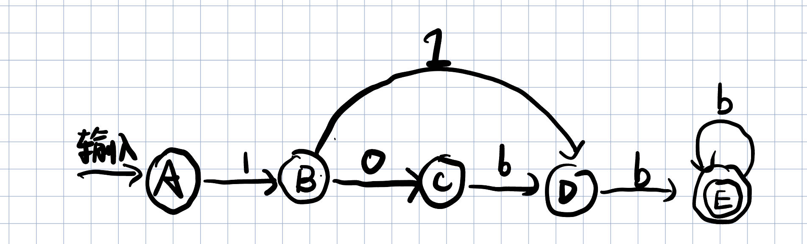

# Homework1

> PB20020480 王润泽
>
> 编译原理与技术

#### 2.1(a)

- 拉丁字母：a-z, A-Z
- 阿拉伯数字：0, 1, ..., 9
- 空白符：空格、水平制表符、垂直制表符、换行、换页
- 特殊符号：! " # % & ' () * + , －. / :; < = > ? [ \ ] ^ _ { | } ~

#### 2.2

| 记号 | 属性               |
| ---- | ------------------ |
| long | long 关键字        |
| id   | grad在符号表的指针 |
| （   | ( 分隔符           |
| long | long 关键字        |
| id   | p 在符号表的指针   |
| ，   | ，分隔符           |
| long | long 关键字        |
| id   | q在符号表中的指针  |
| ）   | ）分隔符           |
| {    | { 分隔符           |
| if   | if关键字           |
| (    | ( 分隔符           |
| id   | p 在符号表的指针   |

| 记号      | 属性             |
| :-------- | :--------------- |
| relation  | ==               |
| number    | 0                |
| )         | )分隔符          |
| comment   | /* then part */  |
| return    | return 关键字    |
| q         | q 在符号表的指针 |
| ;         | ;分隔符          |
| else      | else关键字       |
| comment   | /* then part */  |
| return    | return 关键字    |
| gcd       | gcd在符号表      |
| （        | ( 分隔符         |
| q         | q 在符号表的指针 |
| ，        | ，分隔符         |
| p         | p 在符号表的指针 |
| operation | %                |
| q         | q 在符号表的指针 |
| )         | ）分隔符         |
| ；        | ；分隔符         |

#### 2.3 a: 0(0|1)*0

以0开头和0结尾的长度至少为2的只含’0‘，’1‘的串

#### 2.4 h: 所有不含子串011的0和1的串

$$
1^*(0^+1)^*0^*
$$

#### 2.7 c:  $((\varepsilon|a)b^* )^*$

#### 2.15 构造一个最简的DFA，它能接受所有大于101的二进制整数

大于101的二进制整数有：110，111，1000，1001....

即只要是大于3位的二进制数或者是110，111的3位二进制数都满足条件

正则表达式，写作：
$$
1\left((0(0|1))|1\right)(0\vert1)^+
$$
为了方便表达，定义：
$$
\bold b\iff(0|1)
$$
所以有
$$
1((0\bold b)|1)\bold b^+
$$
那么最简DFA写作

